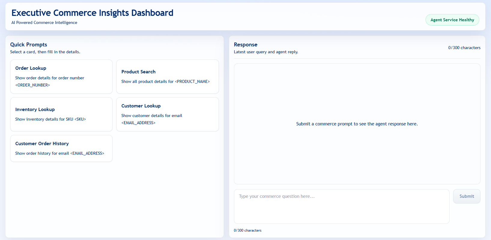
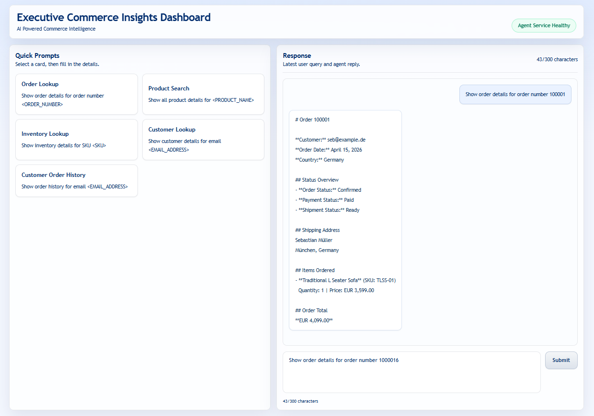

# Commercetools Agent

Executive Commerce Insights is a two-part application for querying commercetools data through a natural-language chat experience.

The repository contains:

- `executive_agent/`: Python FastAPI backend agent
- `executive_dashboard/`: Next.js executive dashboard frontend

The frontend sends a single `prompt` field to the backend. The backend decides the tool, calls commercetools, normalizes the response, asks the configured LLM to write the executive summary, and returns a standardized JSON payload to the dashboard.

## AI Commerce Executive Agent Dashboard Interface

<p align="center">
  
</p>

## Dashboard Agent Response Interface

<p align="center">
  
</p>

## Project Goal

Build a reusable, production-style commerce insights assistant for business users and executives.

The system is designed to answer questions about:

- order details
- product search
- inventory availability
- customer profile lookup
- customer order history

## High-Level Architecture

```text
Executive User
    -> Next.js Dashboard UI
    -> Next.js BFF route
    -> Python FastAPI Agent
    -> LangGraph workflow
    -> LLM factory (OpenAI / Gemini / Claude)
    -> commercetools REST APIs
    -> normalized data
    -> human-readable response
    -> dashboard response area
```

## End-to-End Data Flow

```text
1. User enters a commerce question in the dashboard.
2. Dashboard validates the prompt and checks agent health.
3. Dashboard sends JSON to the BFF route.
4. BFF forwards the request to the Python agent with the shared secret header.
5. Python agent selects the right tool using the configured LLM.
6. Python agent calls one or more commercetools REST APIs.
7. Raw commercetools JSON is normalized into business-relevant data.
8. The configured LLM turns the normalized data into a readable executive response.
9. The agent returns the standardized response contract to the dashboard.
10. Dashboard renders the response and any user-friendly error details.
```

## Standard Contract

The dashboard sends:

```json
{
  "prompt": "Show order 100001"
}
```

The backend returns:

```json
{
  "success": true,
  "userQuery": "Show order 100001",
  "toolUsed": "get_order_by_order_number",
  "response": "**Order Number:** 100001\n    *   **Order Date:** 2026-04-15\n    *   **Total Amount:** 4099.0 EUR\n    *   **Order State:** Confirmed\n    *   **Payment State:** Paid\n    *   **Shipment State:** Ready.",
  "data": {},
  "error": null
}
```

## Core Requirements

- Next.js frontend with App Router and a BFF layer
- Python FastAPI agent backend
- LLM provider factory pattern
- tool-calling architecture
- commercetools REST API integration
- environment-based configuration
- standardized request and response JSON
- no frontend business logic
- clear error handling and logging

## Implementation Notes

- The dashboard is provider-agnostic.
- LLM/provider selection is configured in the Python agent layer.
- The dashboard renders the assistant response text and raw errors (if any).
- Structured commercetools `data` stays in the API response for future UI rendering, but the current dashboard keeps the chat view text-only.

## Local Development

Backend:

```bash
cd executive_agent
source .venv/bin/activate
uvicorn app.main:app --reload --host 0.0.0.0 --port 8001
```

Dashboard:

```bash
cd executive_dashboard
npm install
npm run dev
```

## Verification

Backend:

```bash
cd executive_agent
.venv/bin/python -m pytest executive_agent/tests
```

Dashboard:

```bash
cd executive_dashboard
npm run lint
npm run test
npm run build
```

## Environment

Each app has its own environment file:

- `executive_agent/.env`
- `executive_dashboard/.env.local`

Keep the shared dashboard secret aligned between them so the dashboard can reach the Python agent.

